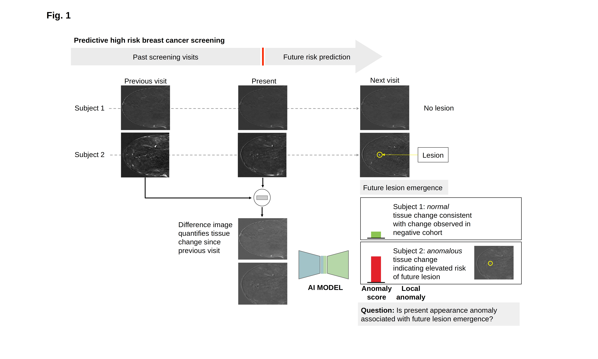

f-AnoGAN for prediction of anomalies in high-risk breast cancer women
===================================================================

Code for reproducing **f-AnoGAN** training and anomaly scoring presented in [*"Deep learning for predicting future lesion emergence in high-risk breast MRI screening: a feasibility study"*](https://eurradiolexp.springeropen.com/articles/10.1186/s41747-023-00343-y). This work extends **f-AnoGAN**: [*"f-AnoGAN: Fast Unsupervised Anomaly Detection with Generative Adversarial Networks"*](https://www.sciencedirect.com/science/article/abs/pii/S1361841518302640) ([accepted manuscript](https://github.com/tSchlegl/f-AnoGAN/blob/master/paper/f-AnoGAN.pdf)) for the application to dce-MRI in high-risk breast cancer women.

## Referencing and citing f-AnoGAN
If you use (parts of) this code in your work please refer to this citations:

- Burger, B., Bernathova, M., Seeböck, P. et al. Deep learning for predicting future lesion emergence in high-risk breast MRI screening: a feasibility study. Eur Radiol Exp 7, 32 (2023). https://doi.org/10.1186/s41747-023-00343-y
- Schlegl, T., Seeböck, P., Waldstein, S.M., Langs, G., Schmidt-Erfurth, U., 2019. f-AnoGAN: Fast Unsupervised Anomaly Detection with Generative Adversarial Networks. Medical Image Analysis 54, 30-44. DOI: https://doi.org/10.1016/j.media.2019.01.010

## Prerequisites

- Python (2.7), TensorFlow (1.2), NumPy, SciPy, Matplotlib
- A recent NVIDIA GPU

## f-AnoGAN building blocks

- `wgangp_64x64.py`: Training a 64x64 WGAN architecture yields a trained generator (G) and discriminator (D). Modifies and extends (including `tflib/`) Ishaan Gulrajani's Tensorflow implementation of the WGAN-GP model proposed in ["Improved Training of Wasserstein GANs"](https://arxiv.org/abs/1704.00028) ([GitHub](https://github.com/igul222/improved_wgan_training)).
- `z_encoding_izif.py`: Training the **izi_f** encoder (E) based on the trained WGAN model (G and D). Please refer to the full paper for more detailed information.
- `new_anomaly_detection.py`: Code for anomaly scoring utilizing the trained G, D, and E.

## Setting (image) paths

Image paths are set in `tflib/img_loader.py` and `tflib/new_img_loader.py`. Images should be provided as "*.png" files structured in the following way:
- `trainset_path`     = "path-to-folder-holding-normal-training-images"
- `trainset_val_path` = "path-to-folder-holding-normal-validation-images"
- `test_normal_path`  = "path-to-folder-holding-normal-test-images"
- `test_anom_path`    = "path-to-folder-holding-anom-test-images"

Additionally, the minimum and maximum gray value of each image need to be stored in mat.files corresponding to the images as variables "Min" and "Max":
- `trainset_range_path`= "path-to-folder-holding-ranges-of-normal-training-images"
- `trainset_val_range_path` = "path-to-folder-holding-ranges-of-normal-validation-images"
- `test_normal_range_path` = "path-to-folder-holding-ranges-of-normal-test-images"
- `test_anom_range_path` = "path-to-folder-holding-ranges-of-anom-test-images"

Please edit the files to specify the paths to your datasets.

## Misc

Results of related research work are provided at [CIR](https://radnuk-prod.meduniwien.ac.at/unsere-abteilungen/computational-imaging-research-lab-cir/computational-imaging-research-lab-research/cir-anomaly-detection-and-unsupervised-learning/).
